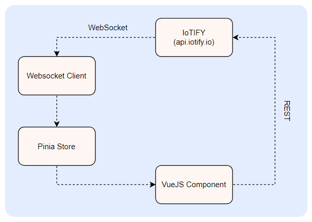

# threejs-client

This is a basic example of integrating IoTIFY with a ThreeJS webapp. Here we use Vue3 with Pinia to maintain a replica of the IoTIFY Glob. 

Please contact us at `hello@iotify.io` if you have any queries.